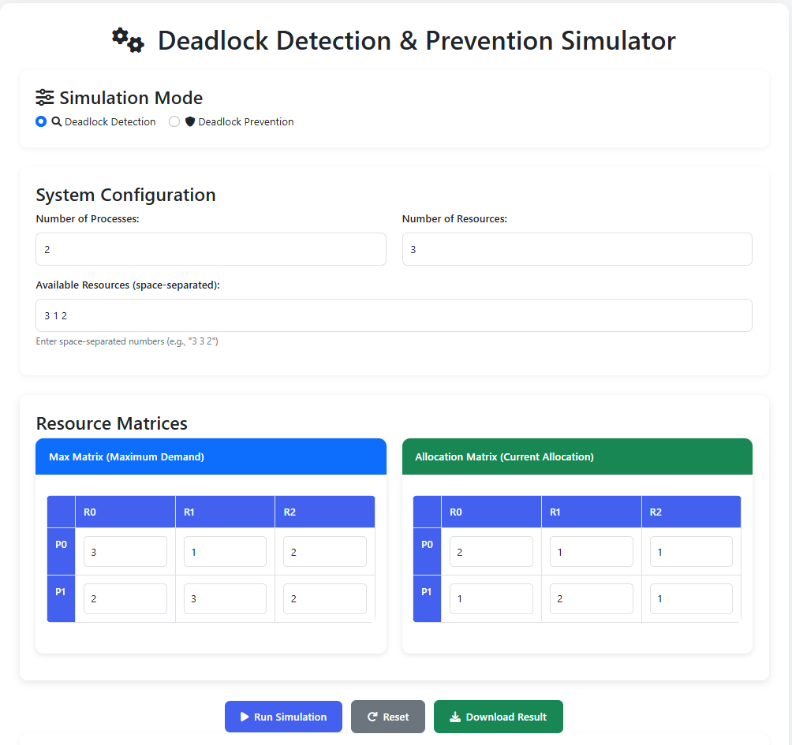
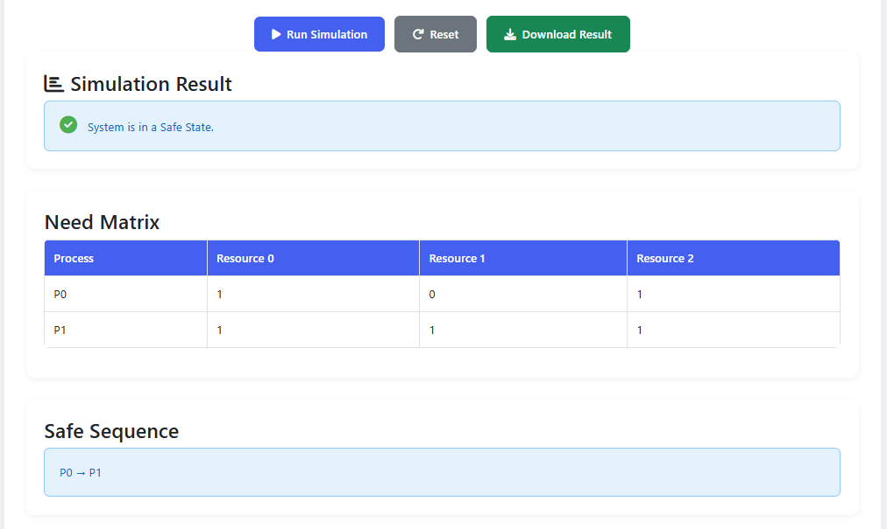
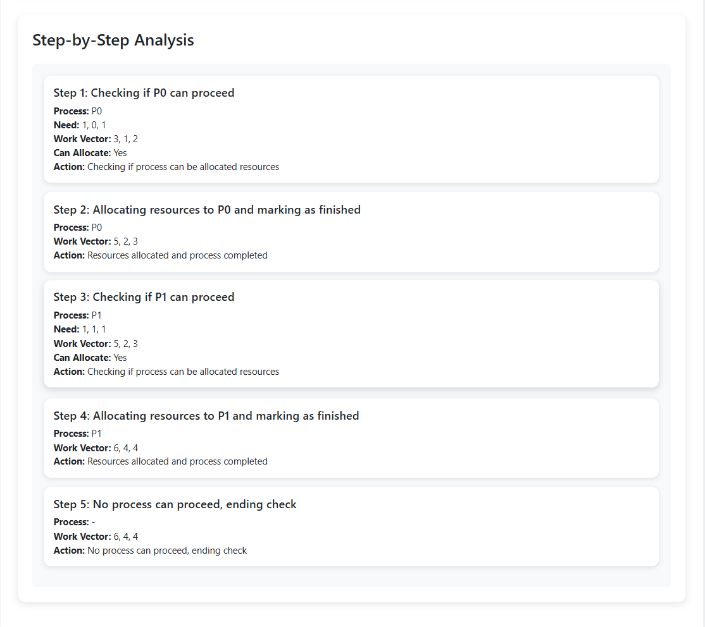

# Deadlock-Detection-and-Prevention-Simulator-
📌 Deadlock Detection & Prevention Simulator

An interactive web-based simulator built using HTML, CSS, JavaScript, and Flask (Python) to visualize deadlock detection, deadlock prevention, and Banker’s Algorithm.
This project was developed as part of a PBL (Project-Based Learning) Team Project, and I contributed the entire frontend interface and UI design.

🚀 Features

🔹 Deadlock Detection

Computes Need Matrix, Work Vector, and Safe Sequence

Generates Wait-For Graph (WFG)

Displays step-by-step simulation and visualization

Identifies deadlocked processes, if any

🔹 Deadlock Prevention

Handles resource request scenarios

Determines if allocation is safe or unsafe

Visual feedback with color-coded alerts

🔹 Dynamic Matrix Input

Auto-generates input tables based on number of processes & resources

Matrix validation and error handling

🔹 UI & Visualization

Modern, responsive UI with Bootstrap

Mermaid.js graphs for WFG

Downloadable simulation output

🧠 Algorithms Implemented

Banker’s Algorithm (Safety Check + Resource Allocation)

Deadlock Detection Algorithm

Wait-For Graph analysis

Need matrix calculation

🛠️ Tech Stack
Frontend (My Work)

HTML

CSS (custom + Bootstrap)

JavaScript

Mermaid.js for graphs

Backend

Python

Flask

Jinja2 templates

📂 Project Structure
/static
    └── style.css      # UI styling
/templates
    ├── index.html     # Main simulation page
    └── result.html    # Result view
app.py                 # Flask backend logic
README.md
LICENSE (MIT)
.gitignore

## 📸 Screenshots

### Main Interface
The simulator provides separate modes for deadlock detection and prevention, with dynamic process and resource matrix inputs.

### Simulation Result
The simulator calculates the Need Matrix and determines the Safe Sequence for the given system state.

### Step-by-Step Analysis
The simulator provides a step-by-step breakdown of the safety check, showing the Need Matrix, Work Vector, allocation decisions, and process completion.

## ▶️ How to Run the Project Locally

1️⃣ Install dependencies
pip install flask

2️⃣ Run the Flask app
python app.py

3️⃣ Open in browser
http://127.0.0.1:5000/

👩‍💻 My Contribution

I designed and developed the entire frontend, including UI layout, styling, responsive design, matrix components, and integration with Flask templates.

I also worked on the visualization (Mermaid WFG), error handling, and user interaction workflow.

📄 License

This project is licensed under the MIT License.
